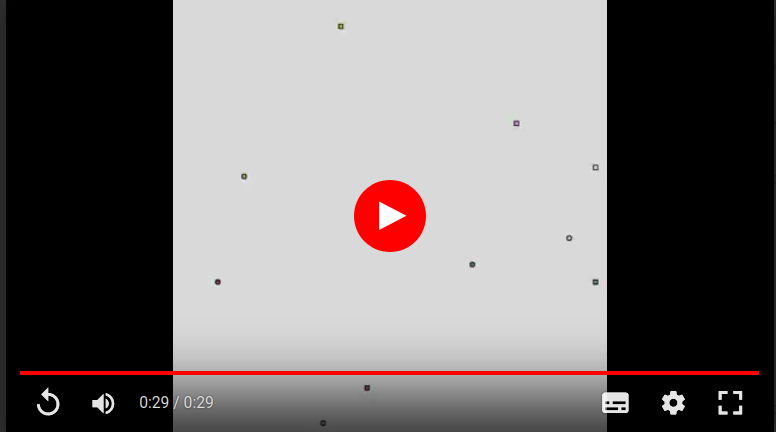
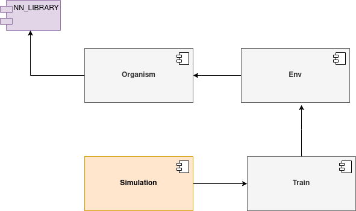

# Project Overview 
This project implements Genetic Algorithm and Artificial Neural Networks from scracth.
We simulate an environment with some creatures and food. The goal is that the creatures reach food using their neural nets. The inputs are distance from food in the two directions (horizontal and vertical) and the output is the direction and sense that the organism must follow. 
A score is given to each organism based on the number of "right" decisions that it makes during the simulation. The 100 firsts with higher score are select to replicate with some mutations. This process repeats until an accepetable score is reached.
In order to stop and continue the simulation in intervals (day or hours), methods for save the current state of organisms, neural networks, score, generations and so on were created.

# Architecture Overview
This is a general explanation, details will be given later.
The module `nn_library` contains implementation of neural network funcionalities (create, duplicate, get output, change weights and other).
`Organism` component comunicates with nn_library to "think". All methods to move, feed, get score, reproduce are in this component.
`Environment` component is responsable for the size of screen, monitor how much orgs ar alive, control generations, simulations, generate reports. It keeps all organisms in an array. 
`Train` component instantiates Environment with all informations that users wants for training (sizes, duration,number of organisms that will reproduce on each geneartion, how much generations, types of reports and so on).
`Simulation` is not part of the final project. It is just the application created by user to access Train component and to test/use the project.

 